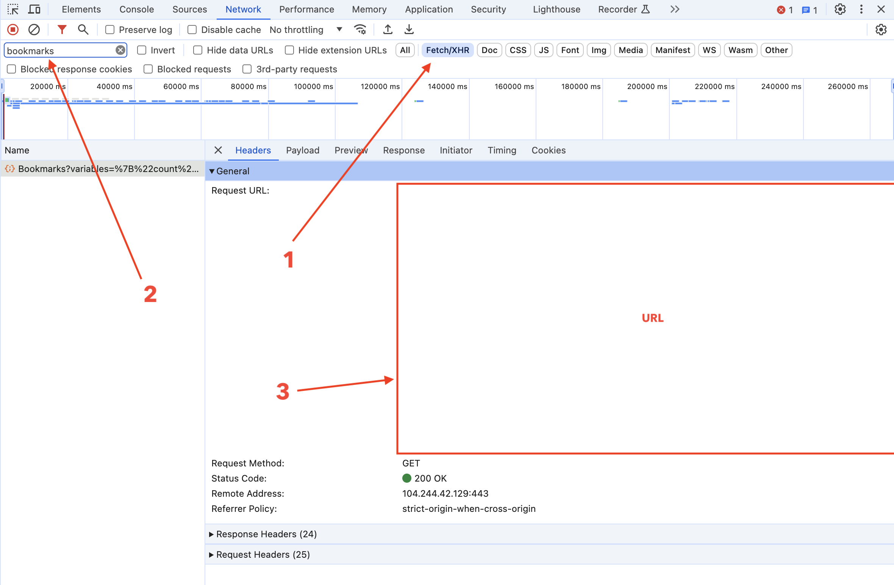
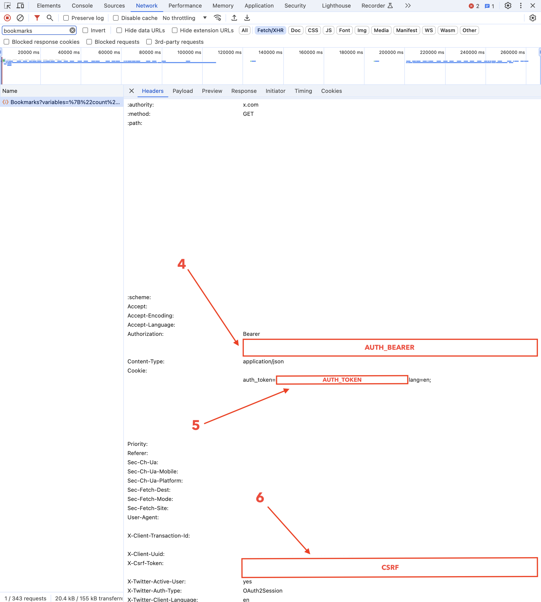

# Twitter Bookmarks Indexer 🐦‍

If you are seeing this page, you likely have many Twitter bookmarks and are seeking a way to search through them.

Accessing these bookmarks via the official Twitter API is a bit complicated, so I've created this simple indexer for your Twitter bookmarks.

It uses:

- A Rust script for retrieving your Twitter bookmarks
- [Meiliseach](https://github.com/meilisearch/meilisearch) for indexing your bookmarks and offering a web interface for searching them

## How to use it?

1. Clone this repository

1. Open the Chrome DevTools and go to the Network tab

1. Open your [Twitter bookmarks](https://x.com/i/bookmarks) page

1. Fill env variables

Copy `.env.example` to `.env` and fill the variables.

In these screenshots, you will see the 4 env variables that need to be set (see the red boxes) and their location within the Chrome Network Inspector.





1. Launch meilisearch

```bash
docker compose up -d
```

1. Index your bookmarks

```bash
cargo run --release
```

The script will also save the bookmarks in a `bookmarks.json` file.

1. Search your bookmarks

Open [`http://localhost:7700`](http://localhost:7700) in your browser.
